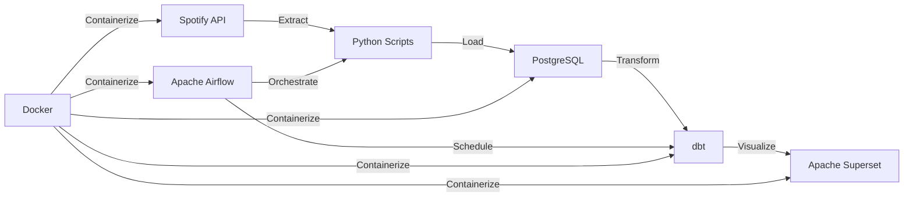
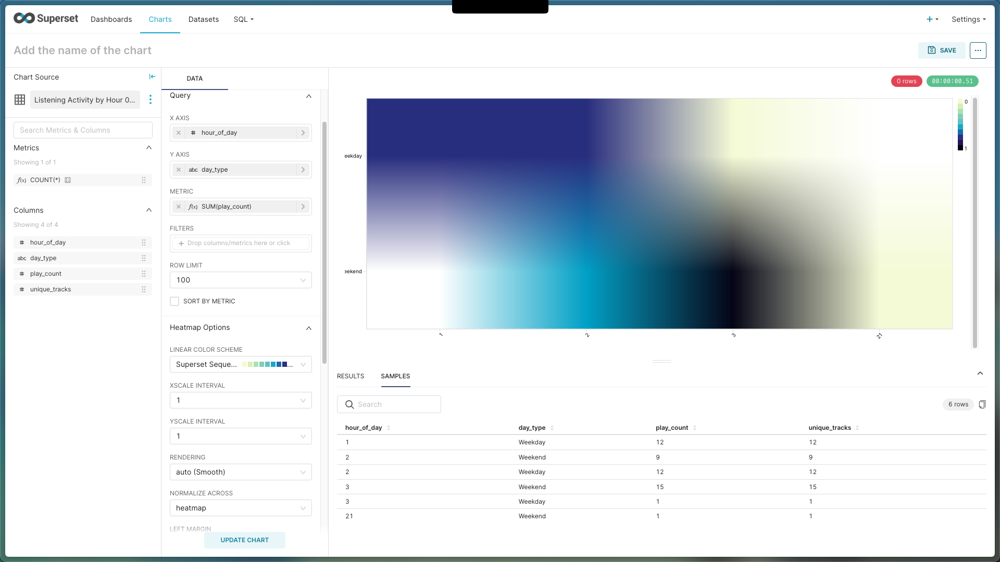
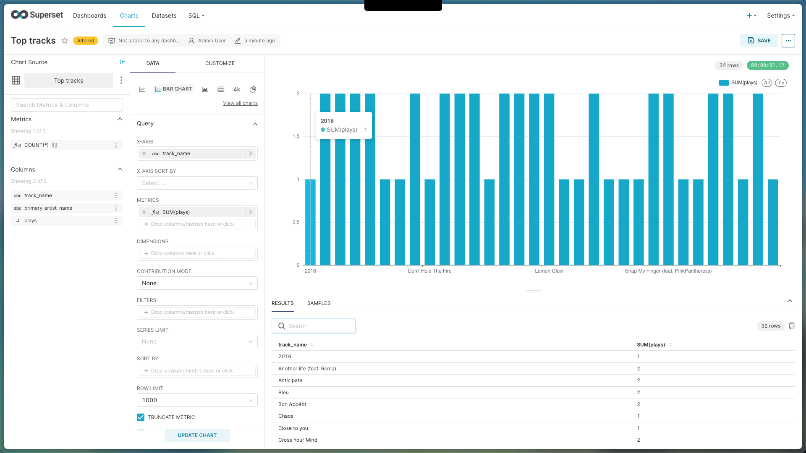

# Spotify Analytics Data Pipeline

A production-grade data engineering project that extracts, transforms, and visualizes personal Spotify listening data using modern data stack technologies.

## Architecture Overview




## Key Features

- **Automated Data Pipeline**: Daily extraction of listening history via Spotify Web API
- **Data Orchestration**: Apache Airflow manages workflow scheduling and monitoring
- **Data Transformation**: dbt creates analytics-ready dimensional models
- **Interactive Dashboards**: Apache Superset provides real-time music insights
- **Containerized Infrastructure**: Fully Dockerized for easy deployment and scaling

## Technology Stack

| Component            | Technology              | Purpose                          |
| -------------------- | ----------------------- | -------------------------------- |
| **Data Extraction**  | Python, Spotipy         | Spotify API integration          |
| **Orchestration**    | Apache Airflow 2.8      | Workflow automation & monitoring |
| **Database**         | PostgreSQL 15           | Data warehouse                   |
| **Transformation**   | dbt Core 1.7            | Data modeling & transformations  |
| **Visualization**    | Apache Superset 3.0     | Interactive dashboards           |
| **Containerization** | Docker & Docker Compose | Infrastructure as code           |
| **Languages**        | Python, SQL             | Core development                 |

## Data Pipeline Flow

### 1. **Extract** (Daily via Airflow)

- Recently played tracks (50 most recent)
- Top tracks (short/medium/long term)
- Top artists with genres
- Audio features (danceability, energy, valence)

### 2. **Load**

- Raw data stored in PostgreSQL `raw_data` schema
- Incremental loads with deduplication
- Data quality checks via Airflow

### 3. **Transform** (dbt Models)

```
raw_data (PostgreSQL)
    │
    ├── staging layer
    │   ├── stg_recently_played
    │   ├── stg_tracks
    │   └── stg_audio_features
    │
    └── analytics layer
        ├── dim_tracks
        ├── dim_artists
        ├── dim_time
        ├── fact_plays
        └── listening_habits
```

### 4. **Visualize**


## Analytics & Insights

The pipeline generates insights including:

- **Listening Patterns**: Peak listening hours and day-of-week trends
- **Music Taste Evolution**: Genre preferences over time
- **Audio Analysis**: Energy, danceability, and mood patterns
- **Discovery Metrics**: New vs. repeated track ratio
- **Top Content**: Most played tracks, artists, and genres

## Quick Start

### Prerequisites

- Docker & Docker Compose
- Spotify Developer Account
- Python 3.9+

### Setup

```bash
# Clone repository
git clone https://github.com/yourusername/spotify-analytics.git
cd spotify-analytics

# Set up environment
cp .env.example .env
# Add your Spotify API credentials to .env

# Start all services
docker-compose up -d

# Initialize Airflow
docker-compose exec airflow-webserver airflow users create \
    --username admin --password admin --firstname Admin \
    --lastname User --role Admin --email admin@example.com

# Run dbt models
docker-compose exec dbt dbt run
```

### Access Services

- **Airflow**: <http://localhost:8080> (admin/admin)
- **Superset**: <http://localhost:8088> (admin/admin)
- **pgAdmin**: <http://localhost:5050> (<admin@spotify.local>/admin)

## Project Structure

```
spotify-analytics/
├── airflow/
│   ├── dags/
│   │   ├── spotify_etl_dag.py      # Daily extraction DAG
│   │   └── dbt_transformation_dag.py # dbt runner DAG
│   └── logs/
├── app/
│   ├── extractors/
│   │   ├── spotify_client.py       # Spotify API wrapper
│   │   └── data_extractor.py       # ETL logic
│   ├── utils/
│   └── main.py                      # Manual extraction script
├── dbt/
│   ├── models/
│   │   ├── staging/                 # Cleaned raw data
│   │   └── marts/                   # Business logic
│   └── dbt_project.yml
├── docker/
│   ├── postgres/
│   └── superset/
├── data/
│   └── raw/                         # CSV backups
└── docker-compose.yml               # Full stack configuration
```

## Data Models

### Fact Table: `fact_plays`

- Grain: One row per track play
- Includes: timestamp, track_id, duration, time dimensions

### Dimension Tables

- `dim_tracks`: Track metadata with audio features
- `dim_artists`: Artist information with genres
- `dim_time`: Date/time hierarchies

### Analytics Views

- `listening_habits`: Daily aggregated metrics
- `top_tracks_analysis`: Ranked tracks with play counts
- `audio_feature_trends`: Mood and energy analysis over time

## Sample Dashboards

### Listening Activity Heatmap



### Top Tracks Analysis



## Challenges & Solutions

| Challenge                  | Solution                                    |
| -------------------------- | ------------------------------------------- |
| Spotify API rate limits    | Implemented caching and batch processing    |
| OAuth in Docker containers | Pre-cached tokens with volume mounts        |
| Data deduplication         | dbt incremental models with unique keys     |
| Real-time updates          | Airflow scheduling with data quality checks |

## Future Enhancements

- [ ] Machine learning for music recommendations
- [ ] Real-time streaming with Apache Kafka
- [ ] Multi-user support with user authentication
- [ ] Cloud deployment (AWS/GCP)
- [ ] Mobile app integration
- [ ] Social features for comparing music tastes

## Lessons Learned

- **Data Quality**: Implementing checks at each pipeline stage prevents downstream issues
- **Orchestration**: Airflow's dependency management ensures reliable data flow
- **Containerization**: Docker simplifies development and deployment across environments
- **Documentation**: dbt's self-documenting models improve maintainability

## Contributing

1. Fork the repository
2. Create a feature branch (`git checkout -b feature/AmazingFeature`)
3. Commit changes (`git commit -m 'Add AmazingFeature'`)
4. Push to branch (`git push origin feature/AmazingFeature`)
5. Open a Pull Request

## Acknowledgments

- Spotify Web API for providing comprehensive music data
- Apache Airflow community for orchestration best practices
- dbt Labs for modern data transformation patterns
- All open-source contributors

---
